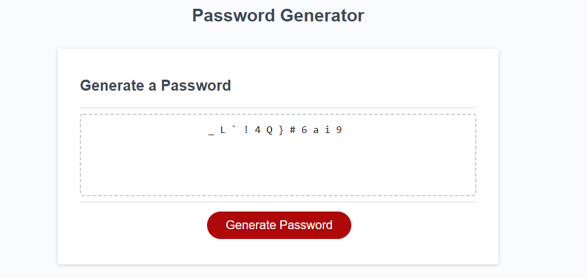

# Password-Generator-

## Acceptance Criteria

```
GIVEN I need a new, secure password
WHEN I click the button to generate a password
THEN I am presented with a series of prompts for password criteria
WHEN prompted for password criteria
THEN I select which criteria to include in the password
WHEN prompted for the length of the password
THEN I choose a length of at least 8 characters and no more than 128 characters
WHEN asked for character types to include in the password
THEN I confirm whether or not to include lowercase, uppercase, numeric, and/or special characters
WHEN I answer each prompt
THEN my input should be validated and at least one character type should be selected
WHEN all prompts are answered
THEN a password is generated that matches the selected criteria
WHEN the password is generated
THEN the password is either displayed in an alert or written to the page
```

Desiged the password generator based on acceptance criteria. First use window.prompt and window.comfirm to let user decide the length of the passowrd, and whether include lowercase, uppercase, numeric, special characters. Second, I created a variable and use if statement to hold password string. And last, use for loop to randomly choose password from the password string and show password in webpage. 
The public webpage link is https://jing-liu-778.github.io/Password-Generator-/
The screenshot of the webpage link below:
